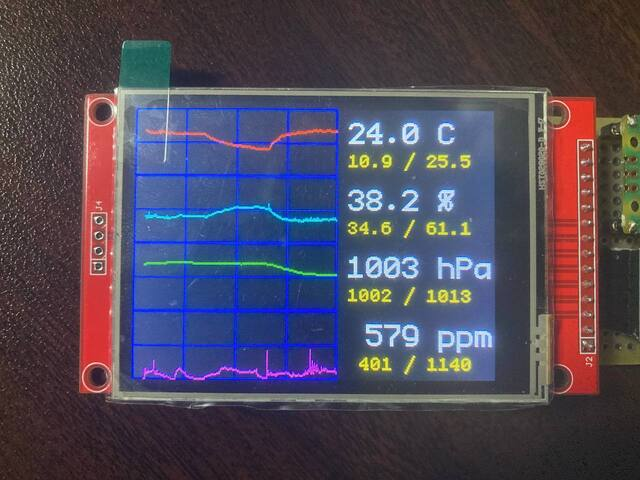

# pico-envmonitor

The environmental monitor with RaspberryPiPico.

This work is based on [shapoco/pico-env-mon](https://github.com/shapoco/pico-env-mon).  
Differences are as follows,
* uses MSP2807
* axes of displayed-graphs are not dynamic, but fixed
* written in Rust

## Features

* Measurement targets
  * Temperature
  * Humidity
  * Pressure
  * CO2
* Graphical plotting of 1 cycle in 24hours
  * all graph axes are fixed.
    * Temperature from -10.0 to 40.0 deg C
    * Humidity from 0.0 to 100.0 %
    * Pressure from 970 to 1030 hPa
    * CO2 from 400 to 2000 ppm
  * the max / min values of each graphs.

## Required H/W

all devices are available at Akizuki-Denshi !

* [RaspberryPiPico](https://akizukidenshi.com/catalog/g/gM-16132/)
* [MSP2807](https://akizukidenshi.com/catalog/g/gM-16265/)
  * LCD 320x240 with ILI9341
    * TouchPanel(XPT2046), SDCard are unused
  * connected via SPI1
* [BME280](https://akizukidenshi.com/catalog/g/gK-09421/)
  * connected via SPI0
* [MH-Z19](https://akizukidenshi.com/catalog/g/gM-16142/)
  * connected via UART0

### Circuit connections

from RaspberryPiPico board, 

|             |  pin  |  No   |  No   |  pin  |            |
| ----------: | :---: | :---: | :---: | :---: | :--------- |
| MHZ19 RX <- |  GP0  |   1   |  40   | VBUS  |            |
| MHZ19 TX -> |  GP1  |   2   |  39   | VSYS  | <- 5V      |
|             |  GND  |   3   |  38   |  GND  |            |
|             |  GP2  |   4   |  37   | 3V3I  |            |
|             |  GP3  |   5   |  36   | 3V3O  | -> 3V3     |
|             |  GP4  |   6   |  35   | VREF  |            |
|             |  GP5  |   7   |  34   | GP28  |            |
|             |  GND  |   8   |  33   |  GND  |            |
|             |  GP6  |   9   |  32   | GP27  |            |
|             |  GP7  |  10   |  31   | GP26  |            |
|   LCD_DC <- |  GP8  |  11   |  30   |  RUN  |            |
|   LCD_CS <- |  GP9  |  12   |  29   | GP22  |            |
|             |  GND  |  13   |  28   |  GND  |            |
|  LCD_CLK <- | GP10  |  14   |  27   | GP21  |            |
|  LCD_SDI <- | GP11  |  15   |  26   | GP20  |            |
|  LCD_SDO -> | GP12  |  16   |  25   | GP19  | -> BME_SDI |
|  LCD_LED <- | GP13  |  17   |  24   | GP18  | -> BME_CLK |
|             |  GND  |  18   |  23   |  GND  |            |
|             | GP14  |  19   |  22   | GP17  | -> BME_CS  |
|  LCD_RST <- | GP15  |  20   |  21   | GP16  | <- BME_SDO |

## License

* MIT License

## Author

* tkhshmsy@gmail.com
